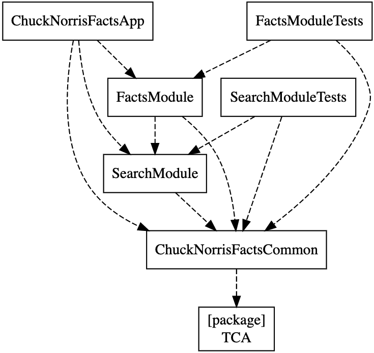

Seja bem-vindo ao projeto Chuck Norris.

No desenvolvimento do projeto foi utilizado `xcodegen` para gerar o Xcode project. A arquitetura foi desenvolvida com [TCA](https://github.com/pointfreeco/swift-composable-architecture), Combine e SwiftUI.

Divirta-se! 🙂

- [📈 Gráfico de dependência](#-gráfico-de-dependência)
- [🌟 Features](#-features)
- [📲 Instalação](#-instalação)
- [📋 Próximos passos](#-próximos-passos)
        - [Projeto gerado com XCodeGen](#projeto-gerado-com-xcodegen)
- [👨🏻‍💻 Autor](#-autor)

## 📈 Gráfico de dependência

## 🌟 Features

- [x] Modularizável
- [x] Compatível com dark mode

## 📲 Instalação

Normalmente esse projeto necessita do [XCodeGen](https://github.com/yonaskolb/XcodeGen) instalado para que o xcodeproj seja gerado, porém foi adicionado os arquivos do XCode, sendo assim é só executar `ChuckNorrisFacts.xcodeproj`.

## 📋 Próximos passos

* [x] Criar testes para os módulos
* [ ] Criar testes para a UI

###### Projeto gerado com [XCodeGen](https://github.com/yonaskolb/XcodeGen)

## 👨🏻‍💻 Autor

* Evandro Viva 
